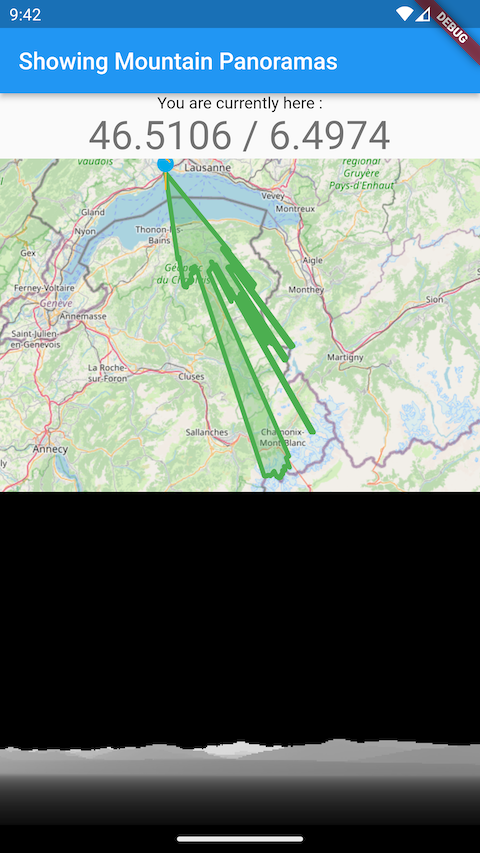
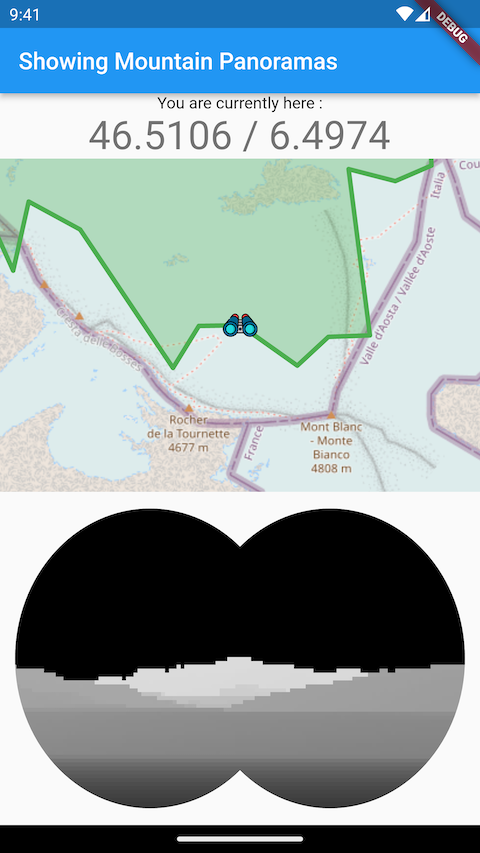

# MountainPanorama

Showing a nice mountain panorama and lets you search for anything in view:
- calculates the panorama and displays it (currently with a flat earth :)
- lets you click in the panorama to link to the map and see what is there
- lets you click in the map to change the viewpoint - visit other places

## Why is this better than other panorama apps?

- Allows you to see all the mountains around you, not only those the app thinks are interesting
- Also shows very far mountains (like the _Mont Blanc_ as seen from _Morges_ in Switzerland),
  which are often omitted in other apps
- You can also zoom in on mountains in the foreground, or villages
- Choose the place from which you want to see the panorama

It uses worldwide elevation data from https://srtm.csi.cgiar.org/

Example screenshot of showing the horizon in the map and as a panorama:

Example screenshot of zooming in on Mont Blanc:

# Next steps

I would like to implement the following:

- having some buttons to enable/disable features:
  - make mountains higher (if they're far away) / lower (if you're in the Valais)
  - enable / disable earth curvature
  - showing the panorama in the direction the phone points 
  - height above current point (standard is 10m)
- add better startup screens: "waiting on GPS" - "downloading maps" - "creating panorama"
  - for this to work, the panorama creator needs to callback from time to time
    the main thread while doing its work.
  - then the panorama should also start painting the main window first, before
    finishing the rest, for a better UX
- load tiles from https://map.ineiti.ch for faster loading
- skip "Searching for GPS" by allowing the user to choose the standing point

## Bugs

- In telescope mode, when panning down, it wraps around. Should stop instead.
- correctly place pin (currently it's a bit off)

## Before release

- add paying voting option for next version

Other ideas are welcome...

## CHANGELOG

- 2023-08-03
  - add a cross to the binoculars and some info:
    - heading
    - distance
    - height
  - add a button to update GPS
  - make working iOS version

- 2023-07-13
  - when starting up, there is often a moment when the polygon seems to have two points:
  this is because it still shows the old, pre-defined POI
  - when choosing a new POI on the map, also show "creating panorama"

- 2023-07-11
  - avoid loading twice the same tile
  - show "loading" texts
  - when clicking on the panorama, zoom in the top of the chosen area,
  put a cross in the middle, and let the user pan around

- 2023-07-09 
  - using another dataset which covers the whole earth
  - scrolling also adds the POI
  - tapping for a POI also scrolls, and thus hides the zoom
