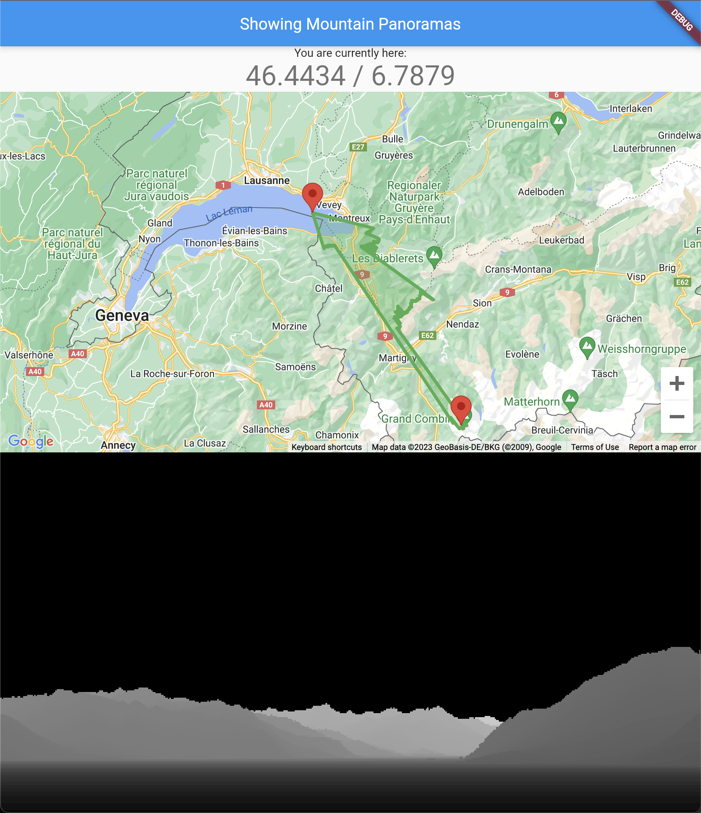

# MountainPanorama

Showing a nice mountain panorama and lets you search for anything in view:
- calculates the panorama and displays it (currently with a flat earth :)
- lets you click in the panorama to link to the map and see what is there
- lets you click in the map to change the viewpoint - visit other places

Example screenshot:

Currently it uses the SwissTopo data to calculate the panorama.

## Why is this better than other panorama apps?

The panorama apps I tried out only showed the mountains they thought I wanted
to see.
Also, some mountains which are very far (like the _Mont Blanc_ as seen from _Morges_ in Switzerland)
are usually not displayed.
And if you wanted to see a specific mountain, there was no feature to do so.
Finally, none of the apps I visited lets you show the view from a place you choose.

## Next steps

I would like to implement the following:

- using another dataset which covers the whole earth
- having some buttons to enable/disable features
- showing the panorama in the direction the phone points

Other ideas are welcome...